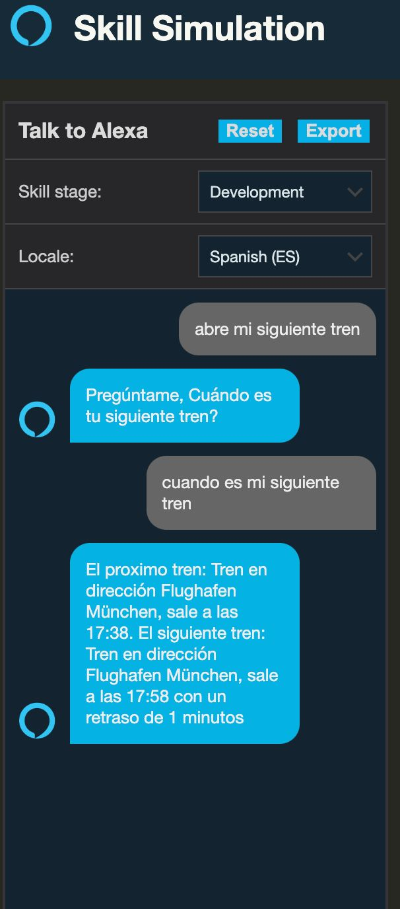

# MyNextPublicTransport

This project is aimed at developing a public transport information system using Alexa voice assistant.

It uses Nodejs and RXJS as a proof of concept.

* Init command: `Alexa, abre mi siguiente tren`
* Command: `cuando es mi siguiente tren`

## Screenshot

